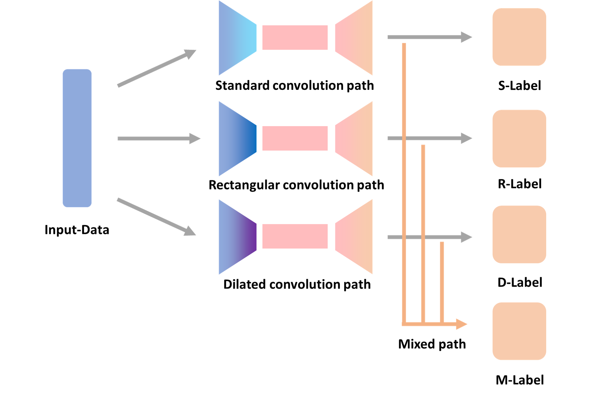
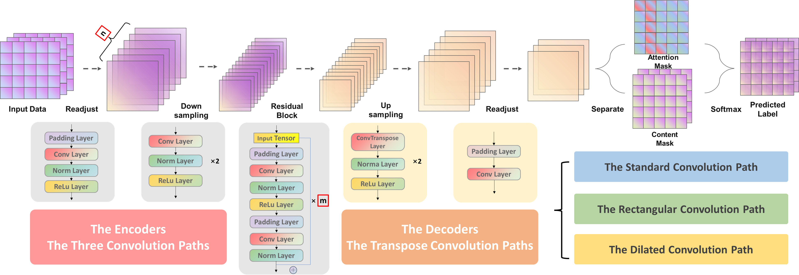
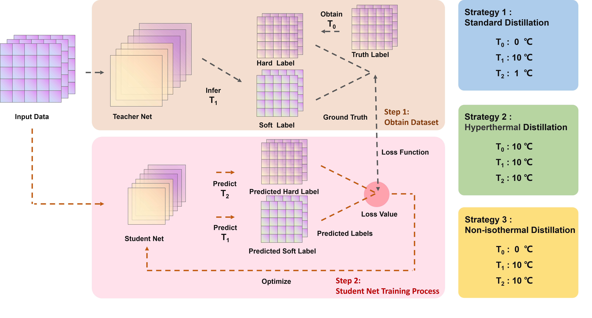

### MCFF-L Net with KD (Knowledge Distillation)

---
A lightweight deep learning network based on knowledge distillation for 
applications of efficient **crack segmentation** on embedded devices

**Abstract**: Timely crack detection of pavement helps inspectors access road conditions and determine 
the maintenance strategy, which can reduce repair costs and safety risks. Deep learning has greatly 
advanced the development of automated crack detection, but there are still challenges that hinder the 
application of deep learning in engineering practice such as the bloated models, the class imbalance 
problem, and the device dependency. This paper proposes a novel high-performance lightweight network 
termed multi-path convolution feature fusion lightweight network (MCFF-L Net) and introduce the concept 
of knowledge distillation. The MCFF-L Net with only 1.18 M parameters achieves F1 score of 85.70% and 
intersection over union (IoU) of 78.22%, which surpasses the popular complicated networks and lightweight
networks. The proposed network is further implemented on an embedded device of Jetson Xavier NX and the
detection speed of pavement cracks can reach 9.71 frames per second (FPS).

---
### Model

Multi-path Convolution Feature Fusion (MCFF)

Multi-path Convolution Feature Fusion (MCFF) Model

### KD (Knowledge Distillation)

---

### How to train?
1. Train teacher model with the original dataset (See Train_1_Step.py) --> Get the trained teacher model
2. Chang the **Temperature** and generate the distillation label from four outputs (See Train_2_Step.py) --> Get the distillation datasets for training student model
3. Train teacher model with the distillation dataset (See Train_3_Step.py) --> Get the trained student model
4. Keep only the Mix-Label Output of the student model
5. model --> ONNX --> TensorRT  (TensorRT.py) Please perform this operation on the appropriate device
6. Try to use the advanced features in TensorRT for further quantification and optimization
7. Deployment!
8. Local Deployment (camera.py) Note the TensorRT file path!
9. Cloud Deployment (PC.py) Remote transfer of segmentation results from the embedded device to the corresponding device

---
### Requirement

zmq
numpy
base64
pycuda
datetime
tensorrt
opencv-python
model_profiler
tensorflow-gpu==2.7.0

**TensorRT 8.2.0**

---
### Support (Coming Soon)
the original dataset :

the distillation datasets (**Temperature**==10 The Best dataset):

the distillation datasets (**Temperature**==5):

the distillation datasets (**Temperature**==15):

the model weight and Loading method:

